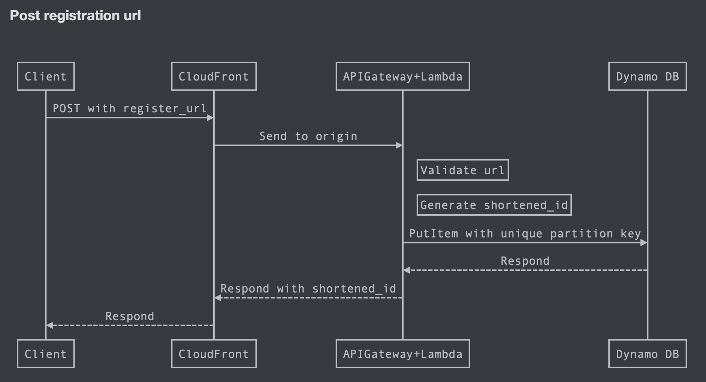

# What is this?

A serverless shorten URL solution with CDK, and the application is written in Golang.

## Architecture
In my point of view, shorten URL is a **read-heavy** service and the output is quite **static**. <br>
So I design the architecture as following:
* **CDN With Long Cache TTL**: Since the mapping between shortened id and redirect url won’t be changed after created, I use a CDN with long TTL to lower the request time from user to server and also optimize the user experience.
* **Serverless Services On Cloud**: Since we don’t have information about peak hours and count yet, it might cause idle/insufficient resources if we build and maintain servers for applications and database. So I choose API Gateway, Lambda and Dynamo DB for the shorten URL solution that we only have to pay based on the request count instead of whole instance. Then we can focus on the application and business logic first and consider about server migration if needed.<br>
* Diagram for get redirect api

* Diagram for post register api


## How to use it?
 * Prerequisites: 
   * Go 1.14 [installed](https://golang.org/doc/install)
   * npm installed
   * cdk [installed](https://docs.aws.amazon.com/cdk/latest/guide/work-with-cdk-typescript.html)
   * aws access with S3, Dynamodb, Lambda, API Gateway, Cloudfront, CloudFormation
 * `npm install`
 * Update AWS_PROFILE and AWS_DEFAULT_REGION in Makefile (use default credential and config if delete)
 * run `make -f Makefile bootstrap` if this is the first time to run CDK in the region
 * run `make -f Makefile deploy` for shorten url service deploy, it might take about 5 minutes. Endpoints of API Gateway and CloudFront will be displayed on the console right after deployment.

## POST Register API:
Register API respond shortened ID in body directly
```
curl -X POST \
  https://${DOMAIN}/register \
  -H 'content-type: application/json' \
  -d '{"register_url":"SAMPLE_URL"}'
```
```
Respond in JSON format:
{
    "shortened_id": "${shortened_id}"
}
```
## Get Redirect API:
```
curl -X GET \
  https://${DOMAIN}/shortened_id/${shortened_id} \
  -H 'content-type: application/json'
```
```
- Redirect directly if shortened_id exists
- Return 404 if shortened_id doesn't exist
```

## Command:
 * `make -f Makefile bootstrap`      bootstrap  for initial setting, should call when use CDK for the first time in account/region
 * `make -f Makefile deploy`         deploy this stack to your AWS account/region
 * `make -f Makefile diff`           compare deployed stack with current state
 * `make -f Makefile synth`          emits the synthesized CloudFormation template
 * `make -f Makefile destroy`        destroy this stack along with resource defined on this stack
